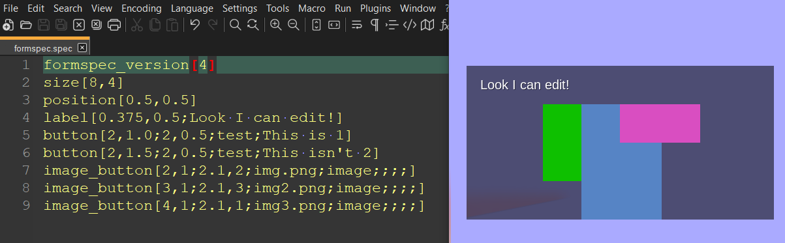

# Formspec Editor
## REALTIME formspec viewer/editor "game" for minetest



## Getting Started 

This mod needs access to an insecure environment in order to work.

Add `formspec_edit` to `secure.trusted_mods` in your `minetest.conf` file.

The file *formspec.spec* in your:

```minetest_folder/games/formspec_editor/mods/formspec_edit```

contains a formspec you can edit and see updates of in real time. (You can also specify a file location with the `formspec_editor.file_path` setting.)
Simply add the game to MT, load up a level of *Formspec Editor*, and you will be greeted with the formspec. 

- To make edits, open the file in your editor of choice and make changes as you see fit. When you hit save, the formspec will auto-update. Best when used side by side. 
- To exit just hit <escape> or use a button_exit[] button. Both send the
fields.quit message.
- You can test with images if you want, adding a "textures" folder to the 
formspec_edit gamemod folder, otherwise images will default to random colors.
- You can show the formspec with builtin, minetest_game or mineclone2 styling (see the `formspec_editor.style` setting)
- You can change the refresh rate by changing the `formspec_editor.update_time` setting
